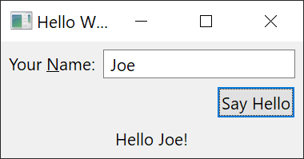

[](https://github.com/eclipse-platform/eclipse.platform.swt/actions/workflows/maven.yml) 

# About

SWT is a cross-platform GUI library for JVM based desktop applications.
The best known SWT-based application is [Eclipse](https://www.eclipse.org).

## Getting Started

SWT comes with platform-specific jar files.
Download them from https://download.eclipse.org/eclipse/downloads/index.html and add the jar file to your classpath.

### Example

```java
import org.eclipse.swt.SWT;
import org.eclipse.swt.layout.GridData;
import org.eclipse.swt.layout.GridLayout;
import org.eclipse.swt.widgets.Button;
import org.eclipse.swt.widgets.Display;
import org.eclipse.swt.widgets.Label;
import org.eclipse.swt.widgets.Shell;
import org.eclipse.swt.widgets.Text;

public class HelloWorld {

	public static void main(String[] args) {
		final Display display = new Display();

		final Shell shell = new Shell(display);
		shell.setText("Hello World");
		shell.setLayout(new GridLayout(2, false));

		final Label label = new Label(shell, SWT.LEFT);
		label.setText("Your &Name:");
		label.setLayoutData(new GridData(SWT.FILL, SWT.CENTER, false, false));

		final Text text = new Text(shell, SWT.BORDER | SWT.SINGLE);
		final GridData data = new GridData(SWT.FILL, SWT.CENTER, true, false);
		data.minimumWidth = 120;
		text.setLayoutData(data);

		final Button button = new Button(shell, SWT.PUSH);
		button.setText("Say Hello");
		shell.setDefaultButton(button);
		button.setLayoutData(new GridData(SWT.END, SWT.CENTER, false, false, 2, 1));

		final Label output = new Label(shell, SWT.CENTER);
		output.setLayoutData(new GridData(SWT.FILL, SWT.CENTER, true, false, 2, 1));

		button.addListener(SWT.Selection, event -> {
			String name = text.getText().trim();
			if (name.length() == 0) {
				name = "world";
			}
			output.setText("Hello " + name + "!");
		});

		shell.setSize(shell.computeSize(SWT.DEFAULT, SWT.DEFAULT));
		shell.open();

		while (!shell.isDisposed()) {
			if (!display.readAndDispatch()) {
				display.sleep();
			}
		}

		display.dispose();
	}
}
```
First, a `Display` is created which is something like the central place of all GUI-related code.
Then a `Shell` is created which in our example is a top-level window.
Then all child controls and listeners are created, including their layout information.
Finally, we set the window's size determines by its child controls and open the window.
The `while`-loop processes all GUI related events until the shell is disposed which happens when closing.
Before exiting, any claimed GUI resources needs to be freed.

Contributing to SWT
===================

Thanks for your interest in this project.

Developer resources:
--------------------

See the following description for how to contribute a feature or a bug fix to SWT.

- <https://www.eclipse.org/swt/fixbugs.php>

Information regarding source code management, builds, coding standards, and more and be found under the following link.

- <https://projects.eclipse.org/projects/eclipse.platform.swt/developer>

Contributor License Agreement:
------------------------------

Before your contribution can be accepted by the project, you need to create and electronically sign the Eclipse Foundation Contributor License Agreement (CLA).

- <http://www.eclipse.org/legal/CLA.php>

Contact:
--------

Contact the project developers via the project's "dev" list.

- <https://accounts.eclipse.org/mailing-list/platform-dev>

Search for bugs:
----------------

SWT used to track ongoing development and issues in Bugzilla .

- <https://bugs.eclipse.org/bugs/buglist.cgi?product=Platform&component=SWT>

Create a new bug:
-----------------

You can register bugs and feature requests in the Github Issue Tracker. Remember that contributions are always welcome!
- [View existing SWT issues](https://github.com/eclipse-platform/eclipse.platform.swt/issues)
- [New SWT issue](https://github.com/eclipse-platform/eclipse.platform.swt/issues/new)

Please bear in mind that this project is almost entirely developed by volunteers. If you do not provide the implementation yourself (or pay someone to do it for you), the bug might never get fixed. If it is a serious bug, other people than you might care enough to provide a fix.
