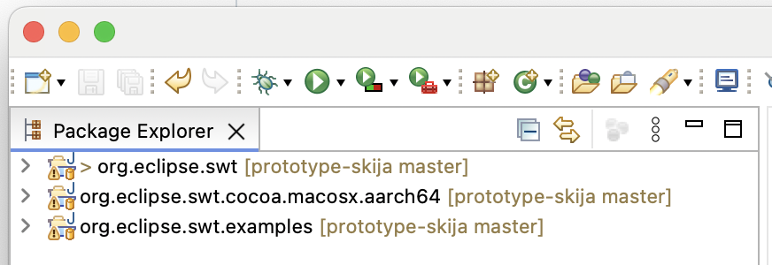
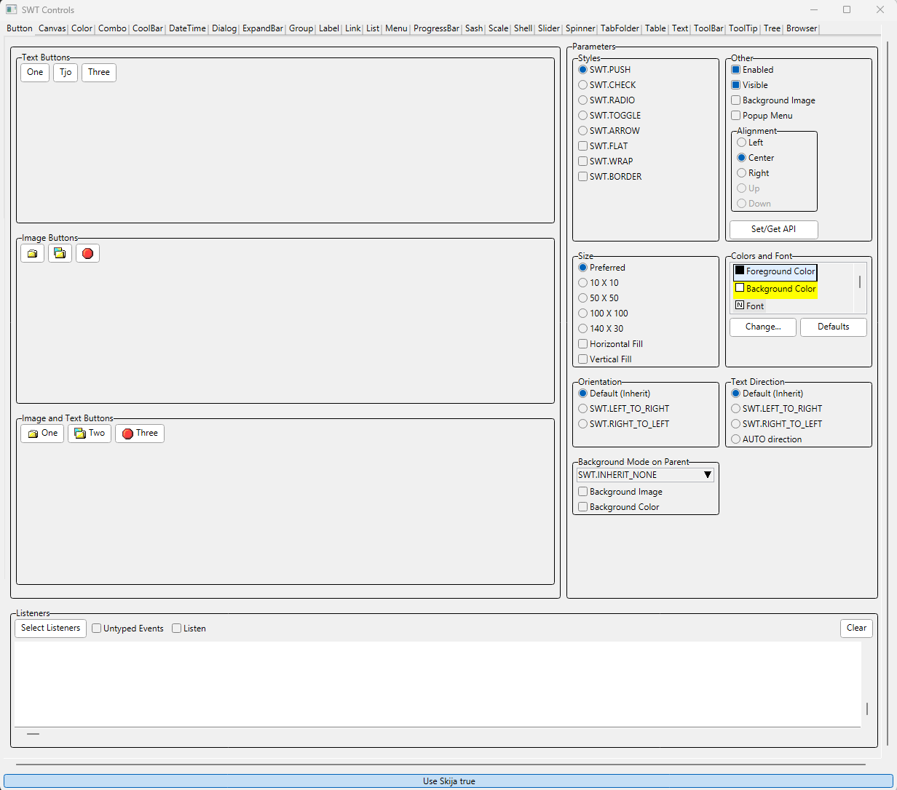
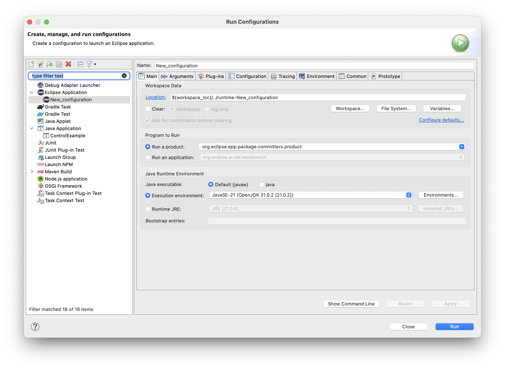

# SWT on Custom-Rendered Widgets With Ski(j)a

This repository is a fork of the original [SWT repository](https://github.com/eclipse-platform/eclipse.platform.swt) containing prototyping work on exchanging the adaptation of native, basic widgets with custom-drawn widgets based on the rendering engine Skia and its Java bindings [Skija](https://github.com/HumbleUI/Skija/).

In the following, you find information about the current state of the prototype and how to try it out. Note that the prototype does currently not provide other/better look and feel or customizability compared to the native widgets. It is supposed to demonstrate feasibility to custom draw widgets based on an efficient rendering engine (as an enabler for improved customizability and look and feel) while seamlessly integrating the custom-drawn widgets with the other, still native widgets. For that reason, the custom-drawn widgets are currently implemented to look similar to the existing widgets they replace, but they could be easily replaced with whatever look and feel is desired.

## How to Contribute

See our [contributing information](CONTRIBUTING.md) to find out how to contribute.

## Getting Started

To test the prototype, an Eclipse IDE has to be set up and the SWT projects from this repository have to be imported into it to start example applications.

Note that the current development does not target all platforms (Windows, MacOS, Linux). Development usually happens on Windows (and partly MacOS), so the experience will be best there. No implementation and testing for Linux has been performed so far.

### Setup

The prototype is currently based on the Eclipse release 2025-06.

1. Set up a Eclipse IDE for Committers 2025-06, e.g.:
   - [Eclipse IDE for Committers 2025-06](https://www.eclipse.org/downloads/packages/release/2025-06/r/eclipse-ide-eclipse-committers)
   - [Eclipse SDK Development Environment](https://github.com/eclipse-platform/eclipse.platform?tab=readme-ov-file#how-to-contribute) using product version "4.35 - 2025-06" in the installer
2. Clone this repository
3. Start the downloaded IDE and import the following projects:
   - The SWT bundle `org.eclipse.swt`
   - The OS-specific fragment `org.eclipse.swt.$WS.$OS.$ARCH` with the placeholders according to your environment, such as `org.eclipse.swt.win32.win32.x86_64` for the Windows fragment
   - _Optional:_ For testing purposes `org.eclipse.swt.examples`

The resulting workspace should look something like this:

### Examples

Starting with this, you can try out the SWT implementation with whatever application you want by also importing the according plug-ins into your workspace. Two reasonable, simple starting points are (1) the SWT `ControlExample`, a demo application containing all basic SWT widgets with configurability for most of their functionality, to see how the widgets look like and behave, and (2) a simple Eclipse application to see how it looks in a complete application.

#### `ControlExample`

The `ControlExample` is part of the example project. It is placed in `org.eclipse.swt.examples.controlexample`. You can run this class as a Java application. The application has tabs for the individual widgets. The tab that opens first is for the `Button`, which is completely custom-drawn. So almost everything you see on that page is custom-drawn via code of the prototype.

At the bottom of the application, a toggle button allows to switch between using the native and the Skija-based renderer ( `GC`) at runtime (see [State](#state)). 
If Skija is used the button will be labed "Use Skija true" otherwise "Use Skija false".

#### Eclipse Application

To start a simple Eclipse application, create a `Run Configuration` via the menu `Run`, menu item `Run Configuration` and in the dialog opening up by double-clicking on the `Eclipse Application` type to create a new configuration that you can launch via the `Run` button:

The Eclipse application that starts will automatically use the custom-drawn widgets. To see a page with mostly custom-drawn widgets, you can, for example, open the `Create Java Project` wizard:

## State

Note that this is work-in-progress prototyping work. 
The implementation is not (supposed to be) production ready.
Currently, there are (at least partial) custom implementations for the following basic widgets:
- Button
- Label
- Text
- Combo
- Sash
- Group
- TabFolder
- Table
- Tree
- List
- Scale
- CoolBar
- Link
- Combo

For rendering, the custom-drawn widgets only rely on the functionalities of the `GC`, such a drawing text and primitives like lines.
In addition to using the existing, native `GC`, i.e., the rendering engine of the operating system, the implementation also contains a `SkijaGC`, providing (parts of) the same functionality but using Ski(j)a for rendering instead. To make these interchangeable, the common functionality has been extracted into an `IGraphicsCanvas` interface.
