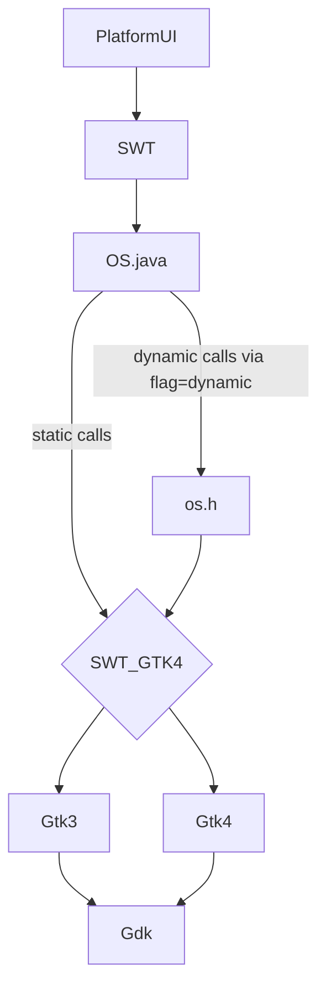
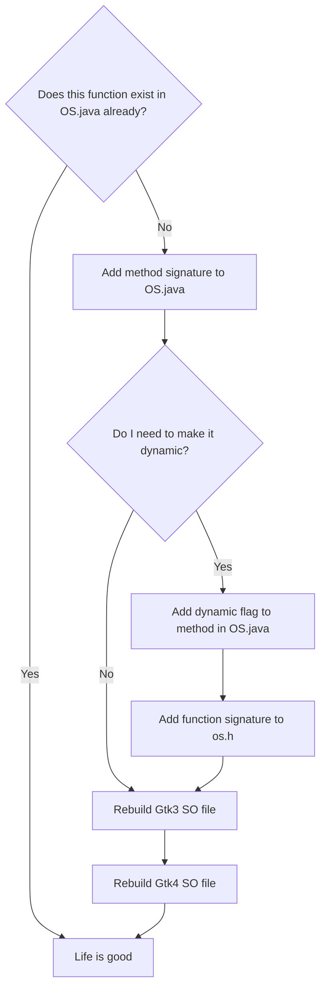

# The Comprehensive Guide to SWT Development for Linux/GTK

## About SWT
SWT is the layer between PlatformUI and the underlying GTK3 or GTK4(experimental) of the system. It can be launched to use GTK3 or GTK4, but cannot use them both at the same time. Communication from Java (SWT layer) to C (native GTK layer) occurs through calls defined in OS.java. The text below describes this hierarchy better:

You will learn:
* How to configure your machine (Eclipse/Git) to contribute SWT patches
* Info on building .SO images to run snippets with newest SWT Master
* Info on GTK Versions, compiling various GTK Versions
* How to add your own gtk_ methods to OS.java
* Tips on SWT Development, how to navigate the code base
* Understanding the underlying glue (swtFixed) between SWT/Java and GTK/C
* Learn how to compile various GTK versions for testing with SWT
* Learn how to make a GTK application in Eclipse & how to debug it
* Learn to debug GTK itself
* Learn how to debug the native GTK (C) part of a running SWT (Java) application
* Learn how to debug the swtFixed custom C code of a running SWT (Java) application

Upon completion of this document, hopefully you will know SWT-fu (as in kung-fu).

**Knowledge Pre-requisites**

* Solid Java knowledge: from class inheritence to multi-threading
* Some C experience: know thy pointers and make files
* GTK background highly recommended but can be learned
* Eclipse: knowing how to use Eclipse is quite essential. But you don't have to know about JFace/PlatformUI/RCP development internals
* Git: for example you should know the difference between merge and rebase. But all git-bits can be learned

## Communication and support
**SWT Community**

If you have questions, you should post them to: platform-swt-dev@eclipse.org

It's also a good idea to sign up for the SWT mailing list. There are #swt-gtk and #eclipse-dev channels on Freenode (IRC) as well.

**Following SWT bugs in Bugzilla**

Whenever you work on a project, you should consider following the default assignee of the project in Bugzilla. This way you find out about new issues and what issues get worked on. To do so, go to bugzilla https://bugs.eclipse.org/ -> Preferences -> Email preferences, and add the email below to your watch list: platform-swt-inbox@eclipse.org

**Following GTK bugs in Gitlab**

It's good to keep track of GTK bugs, as they affect SWT. To sign up, go to their site: https://gitlab.gnome.org/GNOME/gtk.

## SWT Development Environment Setup 
There is an important distinction when running SWT: using the pre-compiled .JAR file, or using the source code in your local Git repository.

Much of this has been based on : https://www.eclipse.org/swt/git.php . If in doubt, read there for additional info.

**.JAR** 

You can download the SWT .JAR file, and add it as a library in your project: https://www.eclipse.org/swt/. However, when you make changes to the SWT source code, these changes will not be visible when running SWT. This is only useful if you develop 'using' SWT, but not SWT itself.

**Source code**

To develop SWT itself, being able to run SWT using the changes made to the source code is important. The process to do is lengthy, but valuable.

**Add the SWT project to the build path**

In order to run snippets with the SWT source code, you will need to add the SWT project to the snippets' project build path. To do this:
* Right click the SWT snippets project in the Package Exlporer
* Select "Properties"
* Select "Java Build Path" on the right hand side
* Select the "Projects" tab and click "Add..."
* Select the SWT project and click "OK"

**Install plugins for SWT Development**

* To verify everything is installed after finishing this section, go to Help -> About Eclipse SDK -> Installation Details
'''Remember to re-install these tools if you re-install Eclipse (or download a new version of Eclipse if you downloaded it).'''

**From Eclipse Update Site** 

* Go to https://wiki.eclipse.org/Eclipse_Project_Update_Sites and find the update site for the version of Eclipse you are running
* Copy the link and then on Eclipse go to Help -> Install New Software
* Paste the link into the 'Work with' field and press Enter
* Check the following to be installed: Eclipse Releng Tools, Eclipse Test Framework, SWT Tools

      Note:  SWT developer tools automatically builds the custom C code that SWT uses to work with GTK. Without the tools, you cannot develop SWT. 

**From Releases Update Site** 
* Go to http://download.eclipse.org/releases/<version> (eg. http://download.eclipse.org/releases/2020-03)
* Check the following to be installed: C/C++ Autotools support, C/C++ Development Tools, Git integration for Eclipse
=== Package Config ===
* Go to https://raw.githubusercontent.com/TuononenP/pkg-config.p2/master/site.xml 

**SWT source code and binary repositories**

Check out the repositories holding the SWT sources and binaries. I usually do this from inside Eclipse, but you can also clone things from the command line. The URI's for the repositories are:

    git@github.com:eclipse-platform/eclipse.platform.swt.git
    git@github.com:eclipse-platform/eclipse.platform.swt.binaries.git

Subsequently import all projects from the SWT source repository.  
From the binary repository, import only: <code>org.eclipse.swt.gtk.linux.x86_64</code>

**Modify the .classpath files**

At first you might get many many errors. You first have to tell the project, that you are on Linux/GTK for things to compile/run properly. Specifically for GTK, you must do the following:
* Open the 'Navigator' view (not package explorer)
* Under 'org.eclipse.swt' look for the .classpath files
* Rename .classpath_gtk to .classpath
* Clean up projects (in Eclipse, Project -> Clean)
* Now run a test snippet or ControlExample.java, it should work without the compilation errors

If '.classpath_gtk' is missing from navigator, you probably have a broken workspace. Make a new one. This sometimes happens when upgrading from older versions of eclipse.

Edit the org.eclipse.swt.examples project and add the org.eclipse.swt project as dependent. Now you should be able to run the 'ControlExample.java'

**Configure git for review**

Please see the eclipse.platform.swt readme for more information.

**References**

https://www.eclipse.org/swt/fixbugs.php

## GTK .SO bindings

**About**

You checked out two SWT repos: SWT and SWT binaries. The SWT binaries contain ready-build SO files to be used with built with the SWT source code. Sometimes you need to add native GTK functions to OS.java, allowing you to use those new functions in the SWT (Java) source code. After any changes to OS.java, you need to rebuild the GTK .SO bindings. Otherwise SWT will complain about "unsatisfied link errors" between the SWT source code and the binaries.

**Prerequisites**

In order to rebuild SWT bindings, your system must have a set of development packages installed on them.

Run the following script to automatically install required dependencies:  

<code>bundles/org.eclipse.swt.tools/gtk/install_sysdeps.sh</code>

In case your linux distribution is not supported by the script, it will print the relevant libraries that you need to install. 

Tip: If you're still getting compile errors when you're rebuilding SWT libraries, try googling "Packages needed for ERROR_THAT_YOURE_GETTING"

See also [https://bugs.eclipse.org/bugs/show_bug.cgi?id=499577 Bug 499577 - Add install_sysdeps.sh to swt.tools]

**Rebuilding gtk \*.so binaries**

The SWT for GTK source code contains multiple "build.sh":  

    1) ./bundles/org.eclipse.swt/bin/library/build.sh (generated by SWT tools) 
    2) ./bundles/org.eclipse.swt/Eclipse SWT PI/gtk/library/build.sh (source code that is copied by SWT tools) 

 *Note: If 1 is missing, you should install SWT tools and do a project clean and rebuild.*

Navigate to folder containing script 1 and execute the script as following: 

<code>./build.sh -gtk3 install (or -gtk4 if building for gtk4)</code>

This will clean up old object files, build gtk3 and gtk4 and copy them to the binary git repository. Build.sh has additional parameters, to find out more:  

<code>./build.sh --help</code>

Note, the script doesn't clean the binary repository. Consider using the following to fully automate cleanup and rebuild:

    #!/bin/bash
    echo "Clean up of bindings"
    set -x  # print info about every command that is executed.
    cd ~/git/eclipse.platform.swt.binaries/bundles/org.eclipse.swt.gtk.linux.x86_64 && \
    git clean -xdf && \
    git reset --hard && \
    echo "Rebuild of bindings"
    cd ~/git/eclipse.platform.swt/bundles/org.eclipse.swt/bin/library && \
    ./build.sh -gtk-all install

**References**

https://www.eclipse.org/swt/jnigen.php

# The SWT codebase
**Learning SWT**

To learn about SWT, try out a bunch of these snippets: https://www.eclipse.org/swt/snippets/

Note, these are available in the SWT repo, search for "Snippet1.java". The org.eclipse.swt.examples project contains lots of examples to try out. There are also many many SWT tutorials online. For example, http://zetcode.com/gui/javaswt/ comes to mind.

You should learn at least:
* Set of basic widgets (Button/Label/Table/Tree etc..)
* Layouts (Absolute [i.e no layout]/Grid/Row/Column/FormAttach)
* Attaching listeners

**General Widget Hierarchy**

Widget is the main Widget. Everything else extends Widget. The most interesting classes are Widget, Control and Composite. Most widgets fork off of these. 

As such, it is useful to be aware of fields/methods in parent classes and which methods get overriden by children. In Eclipse, you can Ctrl+click on a method to see it's super implementation, or derived implementations (this is very useful).

This list below shows the widget hierarchy:

    Widget
    +-- Caret
    +-- Menu
    +-- ScrollBar
    +-- Tracker
    +-- Control
    | +-- Button
    | +-- Label
    | +-- ProgressBar
    | +-- Sash
    | +-- Scale
    | +-- Slider
    | +-- Scrollable
    | | +-- Composite
    | | | +-- Canvas
    | | | | +-- Decorations
    | | | | +-- Shell
    | | | +-- Combo
    | | | +-- CollBar
    | | | +-- Group
    | | | +-- TabFolder
    | | | +-- Table
    | | | +-- ToolBar
    | | | +-- Tree
    | | +-- List
    | | +-- Text
    +-- Item
    +-- CoolItem
    +-- MenuItem
    +-- TabItem
    +-- TableColumn
    +-- TableItem
    +-- ToolItem
    +-- TreeItem

**About GTK Handles**

GTK Handles are basically GTK pointers to the widgets.

When you first look at a widget, you generally first look at the handles that are defined in the widget. For example, each SWT Widget is often made up of several GtkWidgets or has pointers to GtkWidgets. In general createHandle() is a good place to start when you first look at a widget. Also inspect *Handle*() methods of the current widget and the widgets above in the hierarchy: parentHandle(), fontHandle(), childHandle(), etc. They all contain subtleties which may useful.

Handle declarations are inherited. But they are allocated and assigned at a specific widget level. For example Widget declares handle, Control declares fixedHandle but they never allocate them. These will be allocated further down the widget tree in individual widgets themselves.

For example, here is an incomplete diagram of some widgets and their handles. You may observe that widget has handle defined, and Combo has buttonHandle defined:

    Widget
    +-- Control
    | +-- Button
    | +-- Scrollable
    | | +-- Composite
    | | | +-- Combo
    | | +-- Text

**OS.java**

All Java calls are eventually translated to GTK to do the actual drawing.

The bridge between Java and GTK is in OS.java. OS.java is a file that we write ourselves (not generated). It contains many bindings to GTK functions, but not all of them. Sometimes we have to add method signatures in there manually for new functions.

In my case, it is located here in the package path:

      /org.eclipse.swt/Eclipse SWT PI/gtk/org/eclipse/swt/internal/gtk/OS.java

**Method Bindings**

These are typically wrapped in a lock:

    /** @param widget cast=(GtkWidget *) */
    public static final native void _gtk_drag_dest_unset(long /*int*/ widget);
    public static final void gtk_drag_dest_unset(long /*int*/ widget) {
            lock.lock();
            try {
                    _gtk_drag_dest_unset(widget);
            } finally {
                    lock.unlock();
            }
    }

**Constants and ENUMS**

C constants and C Enums are delcared as plain ints. like so:

    public static final int GTK_SCROLL_STEP_UP = 6;

*Note: If you need to add a C enum to OS.java, C ENUMS (Enumirations) begin at 0. Do note, that the Javadoc is parsed by the JNI parser. So be careful about what you put in there.*

**Static Strings translated to C-bytes**

GTK uses some static strings in things like registering event handlers. We translate Java strings into C strings like so:

    public static final byte[] key_press_event = ascii("key-press-event");

**GTK version**

A lot of SWT code is wrapped around the if-checks that make sure code runs only on certain GTK versions. The version code is defined in OS.java like so:

    public static final boolean GTK3 = GTK_VERSION >= VERSION(3, 0, 0);

**OS.Java compilation**

SWT tools compiles OS.java down to a set of files like os.c. Be attentive, there are two sets of library files like os_custom.c. This is because one set is the source, the second is copied over during compilation.

Source folder is here (this is where you should make changes):

    ~/git/eclipse.platform.swt/bundles/org.eclipse.swt/Eclipse SWT PI/gtk/library/os_custom.c

Destination/binary/compiled folder is here:

     ~/git/eclipse.platform.swt/bundles/org.eclipse.swt/bin/library/os_custom.c

It is important to understand the difference because later you will be making changes in the source folder, but link the debugger to the source code in the destination/bin folder. Do note, inside the source folder, some of the files we adjust by hand and some of these are generated. The content of ../library/.. is as following:

    os.c
      This file is automatically generated by SWT Tools. It contains native bindings.
    os.h
      This file we adjust manually. It contains special signatures.
    os_stats.*
      These are auto-generated.
    os_custom.h
      This file we adjust manually. We add new function signatures here when we add a new method to OS.java.
    os_custom.c
      This file we adjust manually. This contains our custom code, such as the SWTFixed container.

When SWT Tools re-generates os.h os.c etc., they may appear in your git staging area. When submitting a patch, include these in the submission.

## SWT Code Style Notes

**Javadocs**

No platform dependent info: no technical details that are platform-specific go into Javadocs. (e.g no GTK specific items). putting them in regular non-Javadoc (green) comments is OK.

**Method naming**

GTK functions: any GTK-specific functionality should be gtk_function_name. Even if it doesn't match one-to-one to a gtk function. (do try to avoid conflicts thou).

Any other naming should be general enough to be translated to other platforms.

**Method access modifiers**

Methods should in general not have modifiers unless private/public. 

    void myMethod()...

Avoid 'protected' unless you're sub-classing things.

## SWT Bug naming conventions

**Cheese**

This refers to garbled text or messed up pixels.

**DnD**

Usually used for Drag and Drop.

**Win32/Cocoa/GTK**

These you will see as prefixes in bug-titles. They stand for the different platforms that SWT uses for the Eclipse UI. On Windows it's Win32, on Mac/OSX it's Cocoa, and on Linux it's GTK.

## **Adding custom functions to OS.java**
This flow chart describes the process of adding a new function to OS.java very well: 

**Adding new functions**

New functions are introduced in GTK3 and old functions are deprecated. In these situations we need to manually add these method signatures to OS.java and os_custom.h.

**Dynamic vs. static functions**

Dynamic functions are not build during compile time. They are only called at run time. This allows us to have GTK3 functions in a GTK4 build or run deprecated functions only in GTK3 (or some specific GTK* version range). Dynamic functions have an annotation:

    @method flag=dynamic

**Re-building SO-files**

After you add new functions to OS.java & os.h, you will need to rebuild the SO file for GTK3 & GTK4.

**Dynamic methods and os_custom.h**

Before adding a new function to OS.java, you should understand dynamic functions.

If you inspect OS.java and look at the Javadoc of some of the functions, you will notice a flag like this:

    @method flags=dynamic

This means the command is not compiled, but called dynamically on the fly (runtime). This is useful for functions that are specific to certain versions of GTK. E.g some functions were only introduced in GTK4, as such those won't compile on a GTK3 build. As such you make those dynamic. Similarly, some GTK3 functions are deprecated in GTK4 and so that we only use them in GTK3, thus we make them dynamic.

Note: not all functions have to be dynamic. You should only make them dynamic if there is a need for it. I.e, in general you should only make functions dynamic if they have to be dynamic; this is because if errors do exist, this post-pones them from compile time to run time.

**Determine if function should be dynamic**

It is important to thoroughly check if the function that you are about to add is specific to GTK3, or GTK4 or can be included in both. Be attentive, sometimes there are bugs in the documentation, i.e it might be missing a 'since 3.xyz' flag. The safest way to ensure functionality is to check both the latest GTK3 and GTK4 documentation and read up about the function in both places.

To do that, is to find the function, then change the '4' to a '3' in the URL, for example: https://docs.gtk.org/gtk4/class.Widget.html and https://docs.gtk.org/gtk3/class.Widget.html

For example, gtk_widget_set_halign() is defined in the GTK3 documentation and there is no 'since 3.0' flag. However, upon checking of GtkWidget in GTK2, I found that the function doesn't exist there. Sometimes the function is OK to use in the current stable build, but got deprecated in the most recent unstable build. So check unstable documentation prior to adding the function also. (replace stable with 'unstable' in the URL).

Another indication of functions not being present in certain GTK versions is that you might get an 'implicitly defined function' in the build.sh output.

**Steps to make a function dynamic**

Add the @method flag=dynamic to the Javadoc of the function, and add the signature to os_custom.h. (i.e look at the other signatures, copy & adjust).

Be careful, there is a suffix 'LIB' at the of the function:

    #define gtk_widget_get_preferred_size_LIB LIB_GTK        ## Notice the suffix "_LIB"

The 2nd part of the Define 'LIB_GTK' is a pointer to which library the function comes from. In this case preferred size comes from LIB_GTK. But this can be LIB_GDK or other libraries. Check the GTK documentation to find out where the function comes from.

As usual, after modifying any of the OS files, the SOs need to be rebuilt. Be sure to include 32 bit casting and enable SWT Tools' "32/64 bit checking". SWT Tools also generates JNI bindings (i.e. os.c, os_stat.c, etc.) for you automatically. To force these bindings to be rebuilt, clean your project.

**Adding custom C enums to OS.java**

C Enums are enumerations. I.e, {Red,Green,Blue} is turned into {0,1,2}.

C enums don't map onto Java's enums. Instead, to add an enum like GtkAlign to OS.java, declare some static ints like:

    /**
    * ## Enums, extracted from OS.java (I once had to add this one in).
    */
    /** GtkAlign enum */
    public static final int GTK_ALIGN_FILL = 0;  //Enums start at 0.
    public static final int GTK_ALIGN_START = 1;
    public static final int GTK_ALIGN_END = 2;
    public static final int GTK_ALIGN_CENTER = 3;
    public static final int GTK_ALIGN_BASELINE = 4;

And when you declare a function, delcare the java-doc paramater cast like this:

    @param gtkalign cast=(GtkAlign)    // note (GtkAlign) with no pointer, not (GtkAlign *)

This will allow the native call to understand that the paramater is an enum.

**Appendix: Special custom bindings**

In some rare situations you might have a function that you can't easily make dynamic. E.g an overloaded function that has structs that are supported only in GTK3/GTK4. In java you can overload a function, but in C you cannot.

In such situations, we need to inspect the generated os.c, find the "NO__.." line that is generated by SW Tools and put it into os.h.

Example: g_object_set()
Suppose you have: 

     _g_object_set(long /*int*/ object, byte[] first_property_name, GdkRGBA data, long /*int*/ terminator);       ### GdkRGBA is specific to GTK3.

Add the method signature to OS.java. Clean the project and attempt a build. You will get a build error about GdkRGBA paramater in g_object_set(). This is because GdkRGBA only exists in GTK3.4+.

Now search os.c for "NO__ …. g object set ", you will find something like: 

      NO__1g_1object_1set__J_3BLorg_eclipse_swt_internal_gtk_GdkRGBA_2J 

Then in os.h, near ~ #define NOGdkRGBA you would add: 

    #define NO__1g_1object_1set__J_3BLorg_eclipse_swt_internal_gtk_GdkRGBA_2J

Meaning: (not very interesting as this is SWT generated, but FYI) 

    J - long 
    I - int 
    3B - byte[]

NOTE: if there is a 'J' - long in the signature, you need to add a 2nd line with 'I' ints, like: 

    #define NO__1g_1object_1set__I_3BLorg_eclipse_swt_internal_gtk_GdkRGBA_2I   //J*->I
    #define NO__1g_1object_1set__J_3BLorg_eclipse_swt_internal_gtk_GdkRGBA_2J

Alexander Kurtakov taught me this business. If you get stuck here, consider getting in touch with him for help.

**References**

https://www.eclipse.org/swt/jnigen.php https://www.eclipse.org/swt/jnigen_metadata.php 
http://homepage.cs.uiowa.edu/~slonnegr/wpj/JNI.pdf

## **SWT Fixed Container**
SWTFixed is custom C code that we include in SWT. It is a container that allows us to place SWT Widgets with absolute positioning so that subsequent widgets are drawn beneath each other. (In GtkFixed container, subsequent widgets are drawn on top of previous once). This is achieved by using the gtk_widget_show_unraised() method, (show widget, but do not raise it up).

As such, the swt_fixed_for_all() method that traverses the code is a bit different than standard for_all() methods. 

SWTFixed was introduced in SWT during the GTK2 to GTK3 migration, because the old GtkFixed container was removed in GTK3.

SWTFixed is defined in os_custom.h and os_custom.c. In my case they are here:
    
    ~/git/eclipse.platform.swt/bundles/org.eclipse.swt/Eclipse SWT PI/gtk/library/os_custom.c

**Every widget is based on SWTFixed**

If you inspect a widget, in almost every createHandle() method, you will see the creation and allocation of SWTFixed like so:

    fixedHandle = OS.g_object_new (display.gtk_fixed_get_type (), 0);
    OS.gtk_widget_set_has_window (fixedHandle, true);

This means that SWT is creating a new instance of the SWTFixed container. Normally it then assigns something to the handle variable puts the widgets inside it. 

Usually in GTK you create a drawing surface (GdkWindow) [note the 'd'] and draw one or several widgets inside it. In SWT, we create a new drawing surface (GdkWindow) for every single widget. This is very ineffective but gives SWT more control about drawing order and permits easier implementation of overlapping widgets. At this point it might be beneficial to understand that a GdkWindow is a drawing surface, where as a GtkWindow [note 't vs d' difference] is a shell with decorations like 'X', '-' and it interacts with the X drawing system. More will be discussed in the GTK sections that follow.

**Technical C details**

You might want to read a bit on how to implement a custom widget in GTK. Then SWTFixed will be much easier to understand. It's mostly code copied from other generic GTK containers with a few tweaks here and there. 

Specifically: 
* SWTFixed extends GtkContainer, i.e it inherits all its functions. This can be observed by the SWTFixedPrivate struct, it has a reference to GtkContainer meaning that the GtkContainer widget is its parent
* Supports multiple children because the child object is a list.
* It overrides some function, this can be observed in the init() function, which assigns functions to pointers. I.e.: 
  container_class->forall = swt_fixed_forall;

## **SWT and GTK versions**
With SWT, the version of GTK that you're running on can make a big difference in how your snippet will behave. This is especially true for all things CSS related because there are many changes in that area.

It's not just the difference between GTK3 & GTK4, but keep an eye on the differences between:
* GTK3.8: RHEL 7 and Fedora 19
* GTK3.10: CSS theming introduced, lots of things break between GTK3.8 and GTK3.10 because of this
* GTK3.12: nothing super exciting
* GTK3.14: Fedora 21, RHEL 7.2
* GTK3.16: Fedora 22, removal of stock icons, gtk_widget_override_* functions become deprecated
* GTK3.18: Fedora 23, re-skin of File Chooser, CSS nodes.
* GTK3.20: Fedora 24, complete overhaul of CSS machinery to use CSS nodes. Old style selectors won't work. Changes to GtkInspector.
* GTK3.22: Fedora 25 CSS parser, GtkHeaderBar and GtkPopOver changes.

You can also see the changes here: https://docs.gtk.org/gtk3/changes.html

You can see the changes between GTK3 and GTK4 here: https://docs.gtk.org/gtk4/migrating-3to4.html

Because of the faster pace at which the GTK development cycle works, it is imperative to be able to test on different versions of GTK (within reason). Usually testing 2-3 versions behind is useful for Fedora. Try to test on GTK3.22 as RHEL customers use this and require an especially stable platform. GTK4 support is experimental and being worked on, so testing is based on individual components that are ported.

To find out which exact versions are currently supported by SWT, inspect GTK's Display.java:

  https://github.com/eclipse-platform/eclipse.platform.swt/blob/master/bundles/org.eclipse.swt/Eclipse%20SWT/gtk/org/eclipse/swt/widgets/Display.java

And search for code like this:

    /* GTK Version */
    static final int GTK3_MAJOR = 3;
    static final int GTK3_MINOR = 22;
    static final int GTK3_MICRO = 0;

This means GTK3.22 onward are supported.

Once in a while, you will come across bugs where the version is bumped. Keep an eye on this by following platform-swt-inbox@eclipse.org in the Eclipse Bugzilla. For example:
  https://bugs.eclipse.org/bugs/show_bug.cgi?id=446454

**Finding what version of GTK Eclipse is running on**

Leo Ufimstev wrote an excellent blog post on this subject:
https://coffeeorientedprogramming.wordpress.com/2014/09/29/how-to-compile-various-gtk3-versions-and-run-eclipse-apps-with-those/

**GTK Versions on Fedora/Red Hat**

Your snippet might work well on GTK3.24, but might will fail on GTK3.22. Or someone's code will only work/fail only on some specific version of GTK. You need to be able to run snippets on specific versions of GTK.

You could of course set up 5 VM's with various Fedora/RHEL versions, but it would be tedious to test things. This is especially true for CSS & style related changes. To remedy this problem you can compile different versions of GTK locally and tell SWT to use those versions. Simply use the LD_LIBRARY_PATH environment variable and point it to your .libs folder that you got from compilation. For example:

    LD_LIBRARY_PATH
    /home/ericwill/src/gtk_versions/3-14/gtk/gtk/.libs

Note: GTK releases are as follows. Even numbered releases are stable, odd numbered releases are development releases. Therefore it's unnecessary to test on versions like GTK3.13, 3.15, etc. Instead test on GTK3.22, etc. You can compile any version of GTK3 until GTK3.24.

## **About GTK**
Often you will run into a situation where you have to write native GTK code to see if the issue is in GTK or in SWT. You should become comfortable writing and compiling GTK3 (and maybe GTK4) native code.

## Brief overview of GTK

**GTK vs. GDK**

It's not all "GTK". Some functions start with gDk and some with gTk. Be attentive to the prefix and seek out the relevant documentation. In general, GTK is build on top of the underlying Gdk. For example for Drag and drop, there are GDK and GTK functions like:

    gtk_drag_cancel()
    gdk_drag_abort()

Both are different from one another:
https://developer.gnome.org/gtk3/stable/gtk3-Drag-and-Drop.html
https://developer.gnome.org/gdk3/stable/gdk3-Drag-and-Drop.html

**General structure of GTK**

In fact, GTK is a composition of multiple libraries. But in most cases, GTK/GDK/GLib is all you need to know unless you're working on some drawing related issue.

    //GTK composition:
    GKT+
    |-> X11     (Xlib)     ## Window manager
    |-> Glib ()
        |-> Glib ()
        |-> GObject ()     ## Object-oriented framework
        |-> GModule ()
        |-> GThread ()
        |-> GIO ()
    |-> Cairo   ()         ## 2-D Vector renderer 
    |-> GDK ()             ## wrapper around low-lvl graphics. (fonts/dnd,cursors)
    
    |-> GdkPixbuf ()       ## image manipulation.
    |-> Pango ()           ## Text/Font
    |-> ATK ()             ## Accessibility toolkit.
    
    //Structural overview
    +------------------------------- ----------+
    |             Your Application             |
    +------------------------------------------+
    |                 GtkAda                   |
    |              +-----------------+         |
    |              |      GTK        |         <<< Useful to know.
    |         +----+-----------------+----+    |
    |         |           GDK             |     <<< Useful to know.
    |    +----+------+         +----------+----+
    |    |   Pango   |         |     Cairo     |
    +----+-----------+----+----+---------------+
    |        GLIB         |   X-Window / Win32  |
    +-------- ^ -----------+--------------------+
              |
            Glib has some useful datastructures, e.g lists/hash tables.
    
    //From GTK to your app:
    Xlib <-> GDK <-> GTK <-> Your App ## GDK is intermediate

**Learning GTK**

Good places to get you going are:

* Quick tutorial: This tutorial might not feel 'satisfying' or might not explain things, but it's a good place to get a general picture: http://zetcode.com/tutorials/gtktutorial/

* The official GTK3 Getting-started-guide: https://docs.gtk.org/gtk3/getting_started.html

* The official GTK4 Getting-started-guide: https://docs.gtk.org/gtk4/getting_started.html
 
* There is also a very good book written by Red Hat Labs: "GTK / Gnome Application Development, Havoc Pennington, Red Hat Advanced Development Labs". It is the only book I could find that had good high-level theory on GDK development and it has some nuggets like implementing a custom widget (which is useful to understand SwtFixed container). 

* There are lots of little papers scattered around the web also. I google around for those.

**GTK API documentation**

GTK3 & GTK4 documentation: there is (GTK3|GTK4) documentation, to switch between them change 3 -> 4. E.g:
* https://docs.gtk.org/gtk3/class.Widget.html
* https://docs.gtk.org/gtk4/class.Widget.html

I usually Google with "GTK" and "ref" in the prefix. This usually gets me to the API:

    gtk<Version> ref <Key word>
    
    e.g
    gtk3 ref gtk_combo_box_text
    gtk4 ref gtk_combo_box_text

Note about the unstable API:

You should consider browsing unstable API more often than stable API. Often you will find that some functions get deprecated in latest versions or new functions are added to add missing functionality. Or simply the documentation changes. The general rule of thumb is that before adding new method to OS.java, double check the unstable documentation for that function first.

**Getting help with GTK**

* GTK IRC channel: Folks are very helpful here. I often got responses very quickly. Mostly good for quick little bits and general wisdom.
* GTK bugzilla: If you think you have come across a bug, or need some official statment from GTK folks about some functionality (e.g if something doesn't work in SWT, have a link to a GTK bug that explains things). Posting a bug to the GTK bugzilla is the way to go. E.g: https://bugzilla.gnome.org/show_bug.cgi?id=747798
* Mailing lists: I didn't get many responses when I asked complex questions, but for small & straight forward stuff, people respond quite well: See: http://www.gtk.org/mailing-lists.php
* Stack Overflow: For your broken snippets. Tag things with GTK http://stackoverflow.com/
* See: http://www.gtk.org/development.php

**GTK source code**

You should check out the GTK repository. Often you will look through the GTK source code to find things that are not in their documentation. Usually I look for the macros that cast things e.g GTK_CONTAINER(container) or I look at *.h files to see how widgets are made up.

## **GtkInspector**
GtkInspector is a good friend when it comes to troubleshooting styles/positioning and functionality of widgets. It can provide information about running GTK Applications. Note, this includes Eclipse or a SWT snippet when they run on GTK3.14 or above.

Things it can do:
* Display widget hierarchy
* Live tweaking of properties (including CSS styles)
* Point and shoot widget identification
* Allow traversal of the widget hierarchy (i.e., clicking on an SwtFixed container and then browsing its contents)
* CSS theming on the fly
* Memory, allocation, mapping, and other lower level information

**Opening GtkInspector**

When in a GTK app, press the keybinding for the GtkInspector: Ctrl + Shift + I. Note, to enable the GtkInspector a GSettings setting must be enabled:
  gsettings set org.gtk.Settings.Debug enable-inspector-keybinding true

**Limitations**

GtkInspector launched at the start of an application sometimes does not show new widgets in the hierarchy unless you close and re-open GtkInspector. Furthermore, it does not support re-parenting: for example if a widget that makes calls to gtk_widget_reparent() is run, GtkInspector will not show the updated hierarchy. If hierarchy matters/is crucial, check points/memory addresses.

**References**

Upgrade Ubuntu's GTK to use GtkInspector: http://www.webupd8.org/2014/10/how-to-install-gnome-314-in-ubuntu.html

Leo's blog post on it: https://coffeeorientedprogramming.wordpress.com/2014/10/27/how-to-tell-if-you-are-running-eclipse-on-gtk2-or-on-gtk3/comment-page-1/#comment-8

Matthias Clasen's blog post: http://blogs.gnome.org/mclasen/2014/11/23/gtk-inspector-update/ https://wiki.gnome.org/Projects/GTK+/Inspector

## **C/C++ Development in Eclipse**
Eclipse has a plugin/perspective called "C/C++ Development Tools" or CDT. This is useful for reading the GTK code base as well as writing small native GTK snippets.

**Getting started**

If you are using Fedora Eclipse you can install the CDT using dnf:
  sudo dnf install eclispe-cdt

Alternatively if you are using upstream Eclipse, you can get it from the CDT update site: https://eclipse.org/cdt/downloads.php

To get a feel for using CDT:
* Try a basic hello world C project
* Open Help -> Help Content -> C/C++ Development
* Read the Getting Started guide, it explains how to make new projects
* Make a test C project to play around with, i.e. make a hello world program
* Read and try things from this guide: https://www3.ntu.edu.sg/home/ehchua/programming/howto/EclipseCpp_HowTo.html

**Different types of C projects**

When you create a new C project, you will have an option of several project types. The main types are:
* *GNU Autotools*: this is often used by large open source projects, i.e. GTK. It ties making of projects together with developer tools like valgrind.
* *Executable*: this is a basic project where the make file is managed for you. This is good if you just want to write some C code and try it out.
* *Makefile Project*: this is for when you manage your own makefile. This is useful for existing projects that have make files that you need to manage yourself, or for when you want to learn about makefiles. To enable debug in makefile projects, you need to add the debug flag and remove optimizations:

      -g -O0

**Useful tips for navigating C code using Eclipse/CDT**

You should try all of the above: 
* *Switch between .h and .c files*: you acn press Ctrl+Tab to switch between source code and header units.
* *Open call hierarchy*: I remap this to F1. List all the functions that call this method. Also works on fields of a struct, show all places that reference this variable.
* *Quick outline*: (ctrl+o) See a list of all functions. Search them (regex supported).
* *Open resource*: navigate menu > open resource or Ctrl+Shift+r. This is very useful to find or 'jump' to a file. Supports regex.
* *Refactor*: (shift+alt+r) Rename variables and functions.
* *Build & run*: you can configure a build & run in one hotkey. You should create a run configuration (see help->help content->C/C++Development ->getting started > Creating a simple application). Enable 'auto-build'. Now tie a hotkey to "run-last-launched" (F12 in my case, but maybe F11 in yours).
* *Open element*: (Ctrl+Shift + t) useful for finding functions/structs/unions/enums in the source code base.

**Import GTK source code into Eclipse for browsing**

You can pull GTK sources and tie them into your Eclipse, so that you can navigate/read the source code easier. I then use the GTK source code as a way of reading GTK API. Compared to the web-documentation, reading the source code allows you to quickly jump to struct definitions and see examples of how/where functions are called via call-hierachy.

You also see how certain objects 'relate' to each other, which you sometimes don't see in the web-documentation. You will often find that many functions are just wrappers around other functions. The most frequent use-case is when I write a GTK snippet, I can just jump to the function definition and read the documentation without plowing through the web-documents.

**Git repositories to check out for GTK development**

GTK is made up of several libraries and you need to pull all of them onto your system.

    cd ~/git
    
    #GTK (including GDK)
    git clone https://gitlab.gnome.org/GNOME/gtk.git
    
    #Glib
    git clone https://gitlab.gnome.org/GNOME/glib.git
      
    #gdk-pixbuf
    git clone https://github.com/dieterv/gdk-pixbuf.git
    
    #Cairo drawing library:
    git clone https://github.com/freedesktop/cairo.git
    git clone https://gitlab.freedesktop.org/pixman/pixman.git

**Dependencies required for GTK libraries**

* Depending on the package manager the commands will be different but the package names should be similar. The commands shown here are for Fedora. 
* For GNU Autotools projects, if there are any problems with building the project, check for dependencies using the '''configure''' script in the project root folder. 

### *GTK*
    sudo dnf install gobject-introspection-devel cups-devel colord-devel

    sudo dnf install gstreamer1-devel gstreamer1-plugins-base-tools \
              gstreamer1-plugins-base-devel \
              gstreamer1-plugins-good gstreamer1-plugins-good-extras \
              gstreamer1-plugins-bad-free gstreamer1-plugins-bad-free-devel \
              gstreamer1-plugins-bad-free-extras

### *Pixbuf*
    
    sudo dnf install gtk-doc gettext-devel libtiff-devel libjpeg-turbo-devel

**Importing projects from git into Eclipse**

* You should have the repos checked out: GTK, GLib, gdk-pixbuf, pixman, cairo

**Meson (pixman, GLib, GTK)**

For each of the repos: 
* In your Eclipse workspace, create a new C/C++ Project (Right click -> New -> Other -> C/C++ Project)
* Select "Empty or Existing Meson Project"
* Uncheck 'Use default location' and change the location of the project to the corresponding folder of the repo (eg. ~/git/gtk)
* Click Finish

**GNU Autotools (Cairo, gdk-pixbuf)**

For each of the repos:
* In your Eclipse workspace, create a new C Project (Right click -> New -> Other -> C Project)
* Select "Empty Project" under the "GNU Autotools" project type 
* Uncheck 'Use default location' and change the location of the project to the corresponding folder of the repo (eg. ~/git/cairo)
* If prompted, override old settings

**Referencing projects**

Referencing projects allows Eclipse to know that projects are related. Normally, triggering to build one project triggers a build of other projects. It also get the C indexer to read symbols properly.
* Go to the imported 'GTK' project.
* Right click and go to Properties -> Project References
* Check glib, gtk-pixbuf, cairo, pixman
* Click on Apply & Close

**Rebuild the index**

* In the project explorer, right click on the 'GTK' project -> index -> rebuild.
* Now all errors should be gone, except maybe one like:
  cannot find install-sh, install.sh, or shtool in build-aux "."/build-aux
* To fix, run reconfigure from repo, autotools will rebuild the project bits

**References**

* Eclipse help system: Eclipse -> help -> help content -> C/C++ development
* C++ in eclipse post: https://www3.ntu.edu.sg/home/ehchua/programming/howto/EclipseCpp_HowTo.html
* GTK source code download page: http://www.gtk.org/download/
* Roland Grunberg's blog: https://rgrunber.wordpress.com/2012/04/25/adding-header-files-to-your-cc-project/

## **Writing and debugging GTK applications in Eclipse**

**Prerequisites**
* Update Eclipse fully, either from upstream or by running:
  sudo dnf update eclipse
* Install the pkg-config, gtk3-devel, and gtk4-devel packages.
* The "Pkg-config Support Feature" plugin installed from the "Plugins for SWT Development" section

You should now be able to create your project.

**Header and source code files**

Normally, if you create a GTK project you include the "usr/include/gtk+" paths. The problem with that is that "/usr/include/gtk" only contains header files, not the .c source code files from the GitHub repo. As such you won't be able to see the "guts" of GTK, which are often very useful and essential for when you're debugging SWT.

If you point your include to the GTK GitHub repo instead, then it might not compile unless you go thourgh the effort to compile the related libs (GLib/pixbuf etc…), which is quite a bit of effort. I.e, it's easier to use the GTK that is build in with your system for compilation.

The solution (which at least works for me) is to point the compiler to the system "usr/include" path (1*) and point the indexer to the GTK GitHub repository (2*). This way, when you are compiling, all will compile well and when you are writing code you easy quick-lookup to the GTK source code without having to compile all of this business.

**Making a new C Executable project**

Create a new Eclipse C project (not C++) -> select Executable project, with "Hello World GTK Project" as a template:

If this template is missing, you need to install 'pkg-config' plugin into Eclipse first. Also it's missing if you selected 'C++' as it's only available for 'C' projects. Go to project properties -> C/C++ Build -> Settings -> 'Pkg-config' tab, and select the gtk+-3.0 option.

Go to project properties -> C/C++ Build -> Settings -> 'Pkg-config' tab, and select the gtk+-3.0 option.

Inside src, you should see a .c file that has a hello-world template. This is in the package explorer. Now you should be able to build & run (or debug) the GTK application. (Note, before running the first time, you need to build the project). It should build very quickly. However, when you look up functions, you won't be able to look into the .c files. In order to do this, you need to set the indexer to search inside your GTK git repository.

**Set the indexer to look inside your git repository**

Under the project's properties, there should be a C/C++ Build section. Under Manage Configurations, there will be an "add an indexer" option.

Under "C/C++ General" -> Indexer, click "Enable project specific settings". Under "Indexing Strategy", select "Use a fixed build configuration" and select your newly created 'indexer' configuration.

Under "C/C++ General" -> "Path and Symbols", switch to the 'indexer' configuration, and in the "Include" -> "GNU C", add your workspace GTK/glib/cairo/gtk-pixbuf/pixman projects.

Now click on OK. Right click on your project -> Indexer -> Rebuild index. Now you should be able to build the project as usual, but also when you open function definitions, you should be able to see the GTK source code from your GitHub repo.

**Debugging GTK applications**

Besides stepping through a GTK appliction, you also use the GtkInspector, which can be ran for a GTK3.14+ application to see real-time information about your running GTK application.

You can set launch flags to help debug GTK apps as well as SWT snippets. Set the following global variable to get detailed frame-sizes:

    GTK_DEBUG = geometry

You can also fatal warnings to halt the application upon a warning:
  
    –g-fatal-warnings

## Debugging native GTK code from a running SWT application

Once in a while when troubleshooting an SWT issue, you will get into a situation, where there is a bug in swtFixed container or you need to debug GTK itself to see what goes wrong. For example, there might be different types of behavior for different version of GTK from the same function.

NOTE: the following documentation explains how to enable full debugging capabilities. But if you are only interested in some basic debug info (like the stack frames, the threads and so on), you can simply use <code>gdb -pid <java_process_pid></code> and use commands like <code>bt</code> without rebuilding native libraries.

**How it works**

To debug the 'C' part of a running Java application, you need to 'attach' yourself to the Java Virtual Machine (JVM) from inside Eclipse. But before doing so, you need to compile GTK and SWT bindings with debug flags and optimizations turned off. Here is a diagram to illustrate:

Further, since eclipse.platform.swt is a Java project that contains C code, you will have to create a C project and link to that folder to debug the C code. As a note, the source and binaries will be in different folders, so you will need to create a source and a debug C project.

**Building the SWT JNI bindings with debug support**

You need to rebuild the SWT SO files, but with debug support. This can be easily accomplished by running the SWT JNI bindings script with the -g flag:
  <code>swtjnibuild -g</code>

== Rebuilding GTK with debug support and without optimizations ==

To find out how to compile gtk, see: https://docs.gtk.org/gtk3/compiling.html

You will need to compile GTK with debugging support and optimizations turned off:

    /autogen.sh &&
    ./configure --enable-x11-backend --enable-wayland-backend --enable-debug=yes &&
    make CFLAGS="-g3 -ggdb3 -O0" -j4

**Set the SWT widget to use the new GTK**

Similar to the GTK compilation instructions, you need edit the SWT snippet run configuration and set the environmental variable to point to the freshly compiled .libs folder. E.g:
   
    LD_LIBRARY_PATH = /home/lufimtse/

NOTE: You will have to do this for every single widget/SWT snippet that you wish to debug at the GTK level. git/gtk+/gtk/.libs

**Debug GTK via attach-process**

To debug the GTK, you can attach yourself to the JVM part of the SWT application while it is running.

Inside the GTK code base somewhere, set a break point in a common area:

    gtkmain.c:gtk_main_do_event(GdkEvent *event)         #This will be triggered an almost every GDK event

Launch your SWT application. In terminal execute jps (java proccesses) and identify the PID of your SWT appplication.

    lufimtse@unused-10-15-18-183 pathscripts$ jps
    357 Jps
    2824 LayoutExample    #<<< this is the SWT snippet.

As a side note, I often set the title of a snippet to the PID of the process. This way I don't have to look for it with jps anymore. To do this in java:
  <code>ManagementFactory.getRuntimeMXBean().getName().split("@")[0];</code>

In Eclipse, press Ctrl+3, then search for 'Debug Attached Executable'. (I usually search for 'attached' and it pops up). Search for 'java'. You should see a list of multiple java processes. Pick the one that has the PID of your snippet:

If things went well, Eclipse should break inside the file pthread_join.c somewhere at the 'wait for child' section. Press F8 (continue). Then try to move the SWT widget or do something with it. Eclipse should stop at the gtk_main_do_event(..) function and you should be able to step through the code.

**Debugging swtFixed custom code**

SWT keeps its source code in one place, but during a project clean-up & rebuild, SWT Tools will copy the source code from src folder to the binary folder.

As such, to make changes that have an impact on the code, you need to edit code in the src folder, but to debug you need to open the source code from the binary folder.

To make matters more complicated, during a rebuild, SWT tools will erase the whole binary folder and re-create it. This means that if you imported the folder as a project, the pointer to that folder is lost and the project 'dissapers' from Eclipse. However, there is a way to get around it. You can create a project in some other folder and add a link the SWT binary folder as a source. This way the project survives re-builds.

Source code lies here: (e.g for changes to source code):

    ~/git/eclipse.platform.swt/bundles/org.eclipse.swt/Eclipse SWT PI/gtk/library

SWT Tools then copies code here (for debugging, don't edit as this folder is deleted & recreated): 

    ~/git/eclipse.platform.swt/bundles/org.eclipse.swt/bin/library

* Create two Eclipse "C plain makefile" projects and place them anywhere on your system
* Name them something like "swtCustomDebug" and "swtCustomSource"
* For swtCustomSource:
  * Edit project properties, under Path and Symbols -> Source location, link folder: <code>~/git/eclipse.platform.swt/bundles/org.eclipse.swt/Eclipse SWT PI/gtk/library</code>
  * Under references tab, link to (for function-lookup functionality) (Cairo, GLib, GTK, pixman, gdk-pixbuf, etc.)
  * Rebuild the C/C++ index for this project
* For swtCustomDebug:
  * Edit project properties, under Path and Symbols -> Source location, link folder: ~/git/eclipse.platform.swt/bundles/org.eclipse.swt/bin/library
  * Under references tab, link to (for function-lookup functionality) (Cairo, GLib, GTK, pixman, gdk-pixbuf, etc.)
  * Rebuild the C/C++ index for this project

**Debugging SWT custom**

* Now in swtCustomDebug, in os_custom.c, set a break point somewhere, i.e. swt_fixed_forall(..)
* Open some snippet, i.e. DNDExample.java found in org.eclipse.swt.examples.dnd
* Set the library path of that snippet to the newly compiled GTK (see earlier) & SWTGTK3=1
* Now start a C debug session by attaching to the JVM (as shown earlier). Once you stopped at the join_thread section press F8 to continue.
* Now perform some DnD operation in the SWT snippet. Eclipse should stop the snippet in the swt_fixed_forall(..) code.

**Tips and tricks for GTK/swtFixed debugging**

* Don't use GTK debug info
  * In Fedora, almost every package has debug-info with which you can debug an application. You can install the debug info for GTK as well.
  * Don't do this, it's not very effective as the code is optimized and will jump around a lot. Compiling GTK with optimizations turned off is more efficient.
* GTK handles to SWT handles
  * When you debug GTK part of SWT, there is a bit of a bridge between SWT and GTK that you have to cross. Variable content/identifying widgets etc..
  * Sometimes you want to identify an SWT widget on the GTK side. This is sometimes not a trivial task because in GTK you have GdkWindows with many GtkWidgets drawn on top that don't always map onto SWT widgets in the same way
  * One way to do so, is to look at the GTK handle on the SWT side and then find it on the GTK side. GTK handles are displayed as hex, since the GTK side of things points to valid memory. SWT in Java shows them as are long ints. When debugging SWT app, you can print out handles into console. When stepping through GTK, to identify handles, convert it to decimal.
  * This site is good for the conversion: http://www.binaryhexconverter.com/hex-to-decimal-converter
  * You can also convert using the built in Long library in Java:
  Long.toHexString (OS.gtk_widget_get_window(<handle>);
* [Identify which GdkWindow maps to which GtkWidget using GtkInspector](https://wiki.eclipse.org/images/8/8f/Gdk_window.png) 
* Remember to cast when writing native GTK applications:
  * GtkWidget *button, sometimes a function can accept any widget
  * Bug you need to cast to a particular widget, i.e.: ((GtkButton*)button)->x
* GDB console accepts GDB syntax, you can type commands in the console to control GDB

## Troubleshooting Eclipse

* Workspace in use errors:
  * delete the .lock file in 
  ~/workspace/.metadata/
* Force Eclipse to rebuild all caches: 
  <code>eclipse -clean</code>
* Flush UI settings by starting Eclipse with the flag:
  <code>eclipse -clearPersistedState</code>
* Turn off Eclipse CSS, start Eclipse with the flag:
  <code>-cssTheme none</code>

**Things to be aware of**
* When upgrading major Eclipse versions (ex Mars to Neo), you should probably create a new workspace. Often old workspaces break and cause very odd behaviour (ex .classpath files missing from navigator, broken plugins etc.)

# Appendix
* Eclipse Release milestones and release candidates: https://wiki.eclipse.org/Simultaneous_Release
* Mystical ~/.swt folder
  * Sometimes you may observe a ~/.swt folder in your system. This folder is generated if you launch an SWT application that uses the SWT .jar file instead of the SWT sources. Sometimes this can be instances of Eclipse.
  * On Fedora 22, I once had to soft link the content of that folder to where I keep the regular compiled os.c files to make eclipse use the newly compiled SWT instead of the jar version
* Eclipse CSS is different from GTK CSS. Eclipse dark-theme keeps its CSS in: http://git.eclipse.org/c/platform/eclipse.platform.ui.git/tree/bundles/org.eclipse.ui.themes/css
