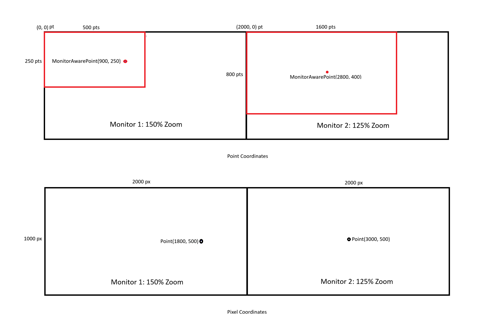

# SWT HiDPI Support in SWT for Windows

## Table of Contents

1. [Introduction](#introduction)
2. [Design Principles](#design-principles)
3. [Architecture Overview](#architecture-overview)
4. [DPI Change Propagation](#dpi-change-propagation)
5. [Resource Management](#resource-management)
6. [Configuration of Autoscaling behavior](#configuration-of-autoscaling-behavior)
7. [Additional Information and Challenges](#additional-information-and-challenges)

---

## Introduction

HiDPI (High Dots Per Inch) support in SWT for Windows enables applications to function as expected on monitors with high pixel density.
This documentation describes the behavior and implementation of HiDPI functionality in the Windows implementation of SWT.

### What is HiDPI?

HiDPI displays have a higher pixel density than conventional monitors.
Windows supports various scaling levels (e.g., 125%, 150%, 175%, 200%) that allow users to make content readable on high-resolution displays.
This UI scaling is of course not limited to HiDPI displays, but can be applied to conventional monitors as well.

### History of HiDPI support

The HiDPI support in SWT for Windows evolved in two phases:

The first phase can be considered as *static* HiDPI support and was targeted on rendering a sharp UI for primary monitor zoom at startup.
Changing the zoom at runtime was not properly support.
Technically it focused on the SWT autoscaling mode *integer200* and a *System* DPI awareness for the OS.
*integer200* results in the native zoom of amonitor being converted internally either to 100% scaling on native zoom < 175% and 200% otherwise.
This means Widget will behave e.g. on a 150% the same as on a 100%, with the expections of Fonts.
*System* DPI awareness means the native monitor zoom is only considered for the primary monitor on startup.
If the application is moved to another monitor with another zoom, the OS will scale the application itself - usually resulting in a blurry UI.

The second phase can be considered as *dynamic* HiDPI support and was targeted on rendering a sharp UI for every monitor zoom  while adapting automatically, e.g. if a Shell is moved to a monitor with different zoom.
The existing implementation was extended and focused on the autoscaling mode *quarter* and a *PerMonitorV2* DPI awareness for the OS.
*quarter* results in all elements using a value rounded down to a multiple of 25% internally in SWT, e.g. 125% will be used as 125%, a custom zoom of 130% would be rounded down to 125%.
This decision was made as the proposed zooms of Windows itself are proposed as *quarter*.
*PerMonitorV2* DPI awareness means the native monitor zoom should be considered for each Window (=Shell) separately.
If a Shell is moved to another monitor with another zoom, the Shell and its contents rescale themselves to the new context.
This is particularly important in multi-monitor environments where different monitors can have different DPI settings.

---

## Design Principles

The introduction and extension of HiDPI support in SWT for Windows required structural changes designed to remain fully backward compatible.
All adaptations follow these principles:

### Backwards Compatibility

Existing behavior should not worsen.
For example, the different autoscale modes ("integer", "quarter", "false" or with fixed value) should still work as previously.
One example for this is that font sizes were always based on the monitor zoom of the Shell, not on the autoscale mode.
This includes of course the implementations for Linux and MacOS of SWT.
Although proper HiDPI behavior in Windows requires more effort and complexity on SWT side than on Linux and MacOS, it must not have a negative side effect on the other implementation.


### Per-Monitor DPI Awareness

Each `Shell` maintains its own zoom.
Widgets inherit this zoom on creation and adjust when the Shell's DPI changes.

### Event-Driven Zoom Propagation

DPI changes are propagated through the widget hierarchy via the standard SWT event system (`SWT.ZoomChanged`) to make it available for consumers as well.

### Consistent Resource Scaling

Images, cursors, and geometric resources maintain multiple OS handles internally for different zooms.
Fonts are managed in a similar way via the `SWTFontProvider`.

---

## Architecture Overview

### Per-Shell Zoom State

The *static* HiDPI support for SWT operated with a single system-wide zoom factor, that was accessible via `DPIUtil.getNativeDeviceZoom()` for the native zoom and `DPIUtil.getDeviceZoom()` for the autoscaled zoom.
While both methods can be used as fallback in certain cases, it is usually not recommended to use those utility function, as they might to fit the zoom of the current SWT `Shell`.

The *dynamic* HiDPI support introduced a per-Shell `nativeZoom`, which:

- is initialized when the Shell is created (from the current monitor),
- is inherited by all child widgets,
- updates when a DPI change event is received from the OS.

Each widget stores its own copy of the zoom to avoid repeated Shell lookups.

#### Widget Initialization

The `nativeZoom` field is defined in the base `Widget` class as a public (but non-API) field:

```java
public int nativeZoom;
```

It should only be accessed from win32 specific components of SWT itself.

**Standard Widgets** (non-Shell widgets):

During widget construction all necessary configuration is done:

```java
public Widget(Widget parent, int style) {
    this.nativeZoom = parent != null ? parent.nativeZoom : DPIUtil.getNativeDeviceZoom();
    // ...
    registerDPIChangeListener();
}
```

- If a parent exists, the widget inherits the parent's `nativeZoom`.
- For top-level widgets (no parent), `nativeZoom` is initialized from the current device zoom via `DPIUtil.getNativeDeviceZoom()`.
This is considered a fallback and should never happen in practice, as top-level widgets are `Shells` and are covered in the next section.
- All widgets automatically register a DPI change listener during construction.
This listener will update the state of each `Widget` to fit the new zoom when a DPI change occurs.

**Shell Initialization**:

Shell widgets as top level widgets use a different initialization sequence:

```java
Shell(Display display, Shell parent, int style, long handle, boolean embedded) {
    super();  // Calls parameterless Widget constructor
    // ...
initialization code ...
    createWidget();  // Creates the native window handle
    this.nativeZoom = DPIUtil.mapDPIToZoom(OS.GetDpiForWindow(this.handle));
    registerDPIChangeListener();  // Explicitly called since Widget(parent, style) wasn't called
}
```

Key differences for Shell:

- Shell calls `super()` (parameterless constructor) instead of `super(parent, style)`.
- `createWidget()` must be called first to create the native window handle (`this.handle`).
- `nativeZoom` is initialized **after** `createWidget()` using `DPIUtil.mapDPIToZoom(OS.GetDpiForWindow(this.handle))` to convert the DPI value from the window handle to a zoom percentage.
This approach ensures independence from internal SWT configuration and uses the actual native zoom retrieved directly from the OS for the monitor where the window is created.
- `registerDPIChangeListener()` is explicitly called because the Widget constructor that normally registers it wasn't invoked.

This ensures that Shell's `nativeZoom` reflects the actual DPI of the monitor where the window is created, which is essential for Per-Monitor DPI Awareness.

### Event-Driven DPI Propagation (`SWT.ZoomChanged`)

SWT propagates zoom changes through the standard event-based model:

1. Windows emits a `WM_DPICHANGED` message.
2. The Shell computes:
   - `newZoom` (percentage),
   - `scalingFactor = newZoom / oldZoom`.
3. SWT sends a `SWT.ZoomChanged` event to the affected Shell.
4. The event is propagated through the widget tree according to layout and dispatching rules.
5. Each widget updates its internal DPI-dependent state via its registered callback.

The `scalingFactor` is only used internally and passed to the event handling methods `handleDPIChange(Event event, float scalingFactor)` in each widget.
It represents the relative change between the old and new zoom and is used to rescale pixel values (for example the column width of a `Table`) that cannot simply be recomputed from the absolute zoom alone.

More details about the event propagation in [DPI Change Propagation](#dpi-change-propagation).

### Class-Level Callback Registration

Every `Widget` instance with DPI-dependent state registers a **private** listener for the `SWT.ZoomChanged` event.
All widgets automatically register this listener during construction via `registerDPIChangeListener()`.

This listener:
- Only registers if monitor specific scaling is enabled (`display.isRescalingAtRuntime()`).
- Calls `handleDPIChange()` with the event and scaling factor.

#### Widget-Specific Handlers

Widget provides the package protected DPI change callback method `handleDPIChange()` that is used internally to handle DPI-dependent state.
Subclasses can override it when necessary to update their internal state when DPI changes occur, but must ensure the super call is added as the first item:

```java
@Override
void handleDPIChange(Event event, float scalingFactor) {
    super.handleDPIChange(event, scalingFactor);
    // Widget-specific DPI change handling
}
```

It is intended for internal use only and its purpose is to reduce the amount of listeners per `Widget` instance.
For external `Widgets` usually you do not need to adapt your state on DPI change, if it is necessary the intended way is to register a separate listener for the `SWT.ZoomChanged` event.
Each class contributes only the logic relevant to the state it introduces.
Because listeners are registered per class, inheritance naturally results in hierarchical, layered updates.

### Multi-Variant Resource Model

DPI-dependent resources (`Font`, `Image`, `Cursor`, `TextLayout`, and geometric primitives such as `Path`, `Pattern`, `Region`, `Transform`) follow a consistent internal model:

- Record the zoom at which the resource was created.
- Maintain a mapping of `zoom → OS handle`.
- Create new variants lazily when needed for rendering at another zoom.

`Font` does not apply this pattern internally within the class, but instead uses the `SWTFontProvider` to get matching `Font` instances for a required zoom.
Access to an OS handle is usually provided via a public static non-API method like `Cursor#win32_getHandle(Cursor, zoom)`.
All resources have similar methods.

---

## DPI Change Propagation

### Synchronous vs.
Asynchronous Execution

There are two different (internal) propagation modes for `SWT.ZoomChanged`: *synchronous* and *asynchronous*.
The purpose of the *asynchronous* mode is to improve user experience when dragging Shells between monitors by keeping the UI responsive while the DPI change event is still processed for the controls.

For the asynchronous execution, the processing is split up into multiple chunks and passed separately to the display via:

```java
display.asyncExec(() -> widget.notifyListeners(SWT.ZoomChanged, event));
```

This split-up is only done:
- When a `Shell` receives `WM_DPICHANGED` (to keep the UI responsive while dragging windows between monitors)
- When a `Composite` *has* a layout manager and delegates changes to its children (to ensure layout computation happens only after all zoom updates are complete)

The *synchronous* processing directly notifies the registered listeners about the DPI change:
```java
widget.notifyListeners(SWT.ZoomChanged, event);
```

It is used when:

- a widget's parent is changed via `Control#setParent` (immediate consistency is required)
- a `Composite` has *no* layout manager and delegates changes to its children (geometry must remain stable during recalculation)
- immediate consistency is required (layout recalculation, cached geometry updates)


### Delegation Rules for Zoom Propagation

#### General Flow

When a widget receives `SWT.ZoomChanged`:

1. It updates its DPI-dependent state (fonts, images, geometry, caches).
2. It propagates the event to its children based on `Composite` rules.
3. It propagates the event to its internal children, like `TableColumn` or `TableItem` for `Table`.

#### Composite Delegation Rules

**Composite with Layout Manager → Asynchronous**

- The event is always dispatched to children via `asyncExec`.
- Ensures layout computation happens only after all zoom updates are complete.

**Composite without Layout Manager → Synchronous**

- Children are updated immediately.
- Required for containers where geometry must remain stable during recalculation.

#### Non-Composite Widgets

- Update only their own state.
- Do not propagate the event further except to internal children.

---

## Resource Management

### Fonts

For the internal font handling in SWT, `Font` (OS) handles should be accessed via the `SWTFontProvider`, as it manages Fonts for different zooms:

- Each font resource stores the zoom at which it was created, to be able to check whether it matches the requested zoom
- Each font resource stores the height in points it was created with as this cannot be recalculated later due to rounding when creating the OS font handle with a height in pixels.
- New font handles are automatically created for new zooms if needed by the `SWTFontProvider`.
- Font size in points is consistent for all zooms, but differs in font size in pixels, e.g. a font with 10pt might be 13px if the OS handle is created for 100%, but 17px on 125%.

### Images

Images adhere to the following concept:

- Each image manages multiple OS handles, one for each zoom it is used on.
- Lazy creation: new OS handles are only created when requested.
- The complexity of the multiple ways to create an Image (e.g. via `ImageFileNameProvider`, `ImageDataProvider`, etc.) is managed inside `Image` and should not affect the usage of `Image`.

### Cursors & Geometric Resources

Cursors and Resources such as `Path`, `Pattern`, `Region`, and `Transform` follow a similar pattern:
- Different OS handles for different zooms.
- Lazy creation: new OS handles are only created when requested.
- Automatic selection of the appropriate OS handle based on the requested zoom.

### TextLayout

`TextLayout` resources behave differently because of their usage.
A `TextLayout` and its internal (font and therefore zoom-dependent) state is always calculated for exactly one zoom.
If it is used in the context of a different zoom, its state will be recreated.
The reasoning is that a `TextLayout` and its usage is usually limited to one zoom and not as shared as, e.g., an `Image`, and this adaptation would require a lot of effort without the necessity to do it.

### Automatic resource cleanup

Unused OS resource handles are automatically destroyed to free memory if they are no longer needed.
This cleanup is triggered after each DPI change and disposes handles that were created for a zoom that is no longer used on any of the existing monitors.

---

## Configuration of Autoscaling behavior

### Autoscale system properties

#### Autoscale Modes

The `swt.autoScale` system property controls how native DPI is converted to effective zoom:

- **`false`**: Always returns 100% zoom
- **`integer`**: Rounds to integer multiples of 100% (e.g., 150% → 100%, 175% → 200%) **(default)**
- **`half`**: Rounds to multiples of 50% while keeping the behavior close to integer mode (e.g., 125% → 100%, 150% → 150%, 175% → 200%)
- **`quarter`**: Rounds to multiples of 25% (e.g., 125%, 150%, 175%)
- **`exact`**: Uses native zoom with 1% precision
- **`<value>`**: Fixed zoom percentage (e.g., `"150"` = 150%)

**Example usage:** To set a specific mode, set the system property to one of the above, e.g. to enable *quarter* autoscale mode use: *-Dswt.autoScale=quarter*

#### Dynamic HiDPI support

The `swt.autoScale.updateOnRuntime` system property controls dynamic DPI changes:

- **`true`**: Application rescales when DPI changes (e.g., window moved to different monitor)
- **`false`**: Application remains at initial scaling **(default)**
- **`force`**: Forces runtime rescaling even with incompatible autoscale modes

**Example usage:** To configure the dynamic HiDPI support, set the system property to one of the above, e.g. to enable it use: *-Dswt.autoScale.updateOnRuntime=true*

**Note**: Runtime rescaling requires compatible autoScale modes (`quarter`, `exact`).
Modes like `integer` or fixed values are incompatible with monitor-specific scaling and will only be accepted when `force` is used.

---

## Additional Information and Challenges

### Event Ordering

Because SWT uses standard event semantics:

- listener registration order,
- synchronous vs asynchronous dispatch,
- depth in the widget tree

all influence the order of callbacks.
This ordering is stable and consistent with the rest of SWT's event model.

### Performance Considerations

- New image, cursor, and font handles must be generated for each zoom.
- Asynchronous propagation prevents deep re-entrant layouts.
- Temporary mixed-zoom states may occur until async updates complete.

### Multi-Monitor Scenarios

In multi-monitor environments:

- Each Shell has its own zoom based on the monitor it is located on.
- When a window is moved between monitors with different DPI settings, `WM_DPICHANGED` is sent.
- Widgets must dynamically adapt to new zooms.

Existing usages or extensions of SWT could (implicitly) rely on a static zoom for all monitors.

### Fractional Zooms

 As GDI/GDI+ works with integer pixels, but SWT uses a point coordinate system, fractional zooms (e.g., 125%, 150%) can lead to rounding issues and scaling can lead to slight inaccuracies.
Especially on zooms like 125% and 175%, rendering and layout changes must be carefully tested.

### Coordinate System

SWT's HiDPI support requires coordinating between Windows' pixel-based coordinate system and SWT's point-based coordinate system. 
The coordinate mapping strategy differs between *static* and *dynamic* HiDPI support modes.

#### Windows vs SWT Coordinate Systems

**Windows Coordinate System:**
- Uses absolute pixel values independent of zoom levels
- Primary monitor always positioned at `(0, 0)`
- Other monitors positioned relative to primary monitor

**Example: Two 1000×1000px monitors**
- **Left monitor as primary:** Left `(0, 0, 1000, 1000)`, Right `(1000, 0, 1000, 1000)`  
- **Right monitor as primary:** Left `(-1000, 0, 1000, 1000)`, Right `(0, 0, 1000, 1000)`

**SWT Coordinate System:**
- Uses point-based coordinates normalized to 100% scaling
- Widget positions are relative to parent containers
- Shell coordinates are absolute, mapping to Windows coordinate space

#### Coordinate Mapping by HiDPI Support Mode

**Static HiDPI Support (*System* DPI awareness):**
- Uses `SingleZoomCoordinateSystemMapper`
- Applies uniform scaling based on primary monitor DPI
- All coordinates scaled consistently using single zoom factor

**Dynamic HiDPI Support (*PerMonitorV2* DPI awareness):**
- Uses `MultiZoomCoordinateSystemMapper` 
- Handles per-monitor DPI differences
- Shell positioning requires special handling to prevent coordinate ambiguity

#### Multi-Monitor Coordinate Mapping

The `MultiZoomCoordinateSystemMapper` addresses coordinate ambiguity in dynamic HiDPI support:

**Shell Position Handling:**
- **Top-left position:** Stored in absolute pixels to preserve monitor boundaries
- **Width and height:** Stored in points, adjusted for monitor's zoom factor
- **MonitorAwareRectangle and MonitorAwarePoint:** Coordinate objects track their associated monitor context for accurate pixel-to-point conversion and vice-versa.

**Benefits:**
- Prevents multiple pixel coordinates from mapping to identical point values
- Ensures Shell positioning works correctly across monitors with different zoom levels
- Maintains SWT's point-based abstraction for application developers


Fig: The representation of the pixel coordinates space and points coordinates space using coordinate mappers

### Process & Thread DPI Awareness

Windows differentiates between process and thread DPI awareness.
The process DPI awareness is defined by the executable, e.g. eclipse.exe will start with DPI awareness *System*, all recent javaw.exe will start with DPI awareness *PerMonitorV2*.
SWT will set the thread DPI awareness to *PerMonitorV2* **if and ony if** monitor specific scaling is activated, either via `Display#setMonitorSpecificScaling` or the `swt.autoScale.updateOnRuntime` system property.
If:

- process and thread DPI awareness are the same, the application should always behave as expected
- process DPI awareness is *System* and thread DPI awareness is *PerMonitorV2*: This combination should behave as expected for the *PerMonitorV2* mode.
Still, there could be scenarios, where the application still behaves like *System* DPI aware for a short amount of time.
- process DPI awareness is *PerMonitorV2* and thread DPI awareness is *System*: This combination is not recommended and could lead to unexpected behavior

#### Enforce Process DPI Awareness
If you want to enforce a specific process DPI Awareness, you can follow the guide in the [FAQ](https://eclipse.dev/eclipse/swt/faq.html#winexternalmanifestfile).
This might be useful to enforce *System* process DPI awareness for the javaw.exe or *PerMonitorV2* process DPI awareness for the eclipse.exe
